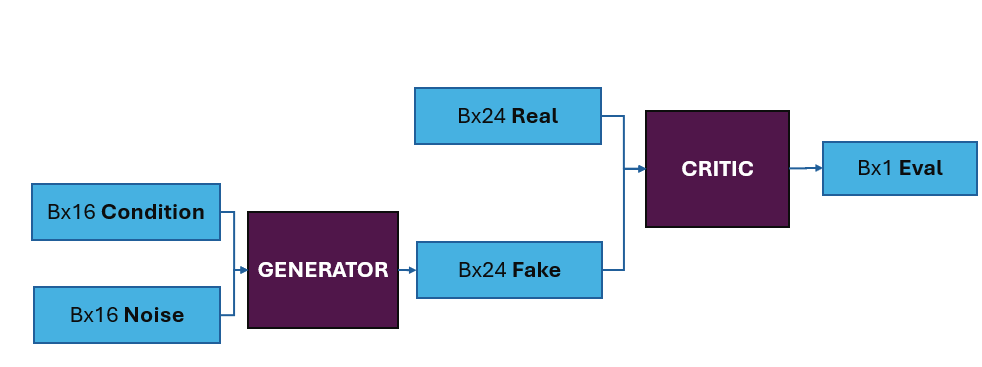
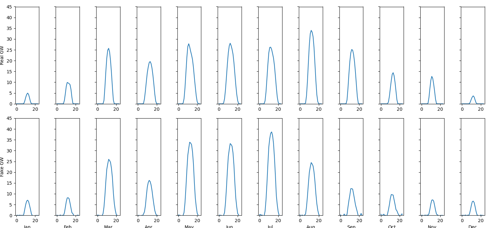

# Conditional Solar-Power-Curve generation using a Conditional-WGAN with Weight Clipping in Pytorch
Using a Conditional-WGAN with Weight Clipping to generate Solar Power Curves. The model is trained on a dataset from [Agora](https://www.agora-energiewende.org/data-tools/agorameter/chart/today/power_generation/01.01.2021/30.11.2023/daily) providing daily electricity generation.
A colab-notebook version is available [here](https://colab.research.google.com/drive/10W8VJkzZwRPK1DCKrc_0-bIVQJR9ePp0?usp=sharing)
## Model
The generator uses a condition vector if size `16` and a noise vector of size `16` to generate a hourly solar power curve of size `24`.
The Critic judges either the fake and condition pair or the real and condition pair to provide gradients to the generator. The critic uses weight clipping to enforce the Lipschitz constraint.

## Results
The model is able to generate realistic solar power curves. The model is trained on 300 epochs with a batch size of 64.

## Further Work
- Implementing a more complex model
- Using more modalities e.g Wind or monthly curves ( this is currently possible but there is no trained model available)
- Using gradient penalty instead of weight clipping